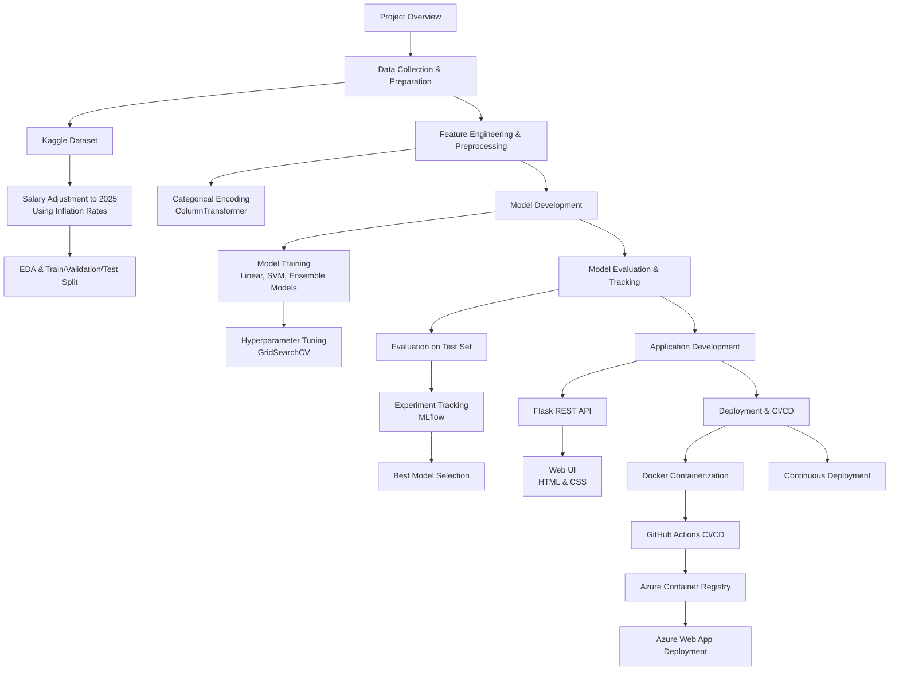

#AI/ ML Professional's Salary Prediction#

This project showcases a production-grade machine learning system built following MLOps best practices, covering the full lifecycle from data preparation to cloud deployment.

##Data Collection & Preparation##

The dataset was sourced from Kaggle. While the data required minimal cleaning, the target variable (salary) spanned multiple years (2019–2023). To maintain real-world relevance, salary values were adjusted to 2025 equivalents using global and U.S. annual inflation rates.

Exploratory data analysis (EDA) was conducted to understand feature distributions and relationships. The dataset was then split into training, validation, and test sets. Categorical variables were processed using Scikit-learn’s ColumnTransformer, ensuring consistent preprocessing across all models.

##Model Training & Hyperparameter Optimization##

A diverse set of supervised learning algorithms was trained and evaluated, including:

- Linear models: Ridge, Lasso, Elastic Net

- Support Vector Machine (SVM)

- Ensemble methods: Random Forest, AdaBoost, Gradient Boosting

Hyperparameters were optimized using GridSearchCV, enabling systematic and fair model comparison.

##Model Evaluation & Experiment Tracking##

All models were evaluated using a held-out test dataset. Experiments—including models, parameters, and performance metrics—were tracked using MLflow, ensuring reproducibility and transparency. The best-performing model was selected for production deployment.

##Application & User Interface##

The trained model was exposed via a Flask-based REST API. A user-friendly web interface was developed using HTML and CSS, allowing end users to interact with the model through a clean and intuitive UI.

##Deployment & CI/CD##

The application was containerized using Docker and deployed via an automated CI/CD pipeline with GitHub Actions. Docker images were pushed to Azure Container Registry, and the application was deployed on Azure Web App. Continuous deployment was enabled to support rapid iteration and future updates.

##Key Skills Demonstrated##

- End-to-end machine learning pipeline design

- Feature engineering and preprocessing with Scikit-learn

- Model selection and hyperparameter tuning

- Experiment tracking with MLflow

- REST API development with Flask

- Containerization with Docker

- CI/CD automation using GitHub Actions

- Cloud deployment on Microsoft Azure

Excited to experience this cool app? Click [Maban](https://ai-salary-prediction-b4ayfph0f5buekgq.australiaeast-01.azurewebsites.net/)
